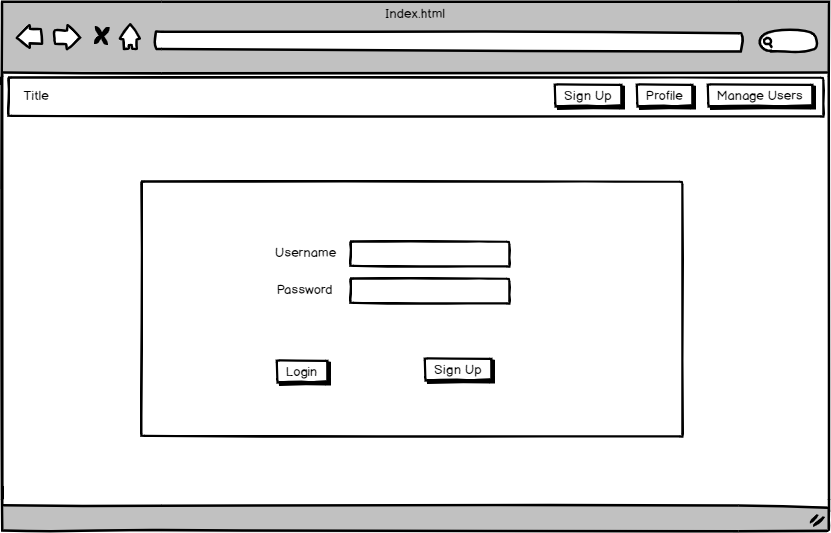

# Personal Interests Manager
This project is to develop an interface for users to create an account, and add the movies, 
tv shows and games that they follow and mark the movies and episodes that they have watched, 
and also the games quests that they have completed. 

In today's world, we watch many different tv shows and often forget where we have left off when we 
take a break from a series. The TV show section of this site will allow users to add their show and 
mark the episodes that they watch as they go so that they can easily come back later and find out where 
they left off. 

Also, we often see movies advertised that we would like to watch, only to forget about them until a year 
later when we see another advertisement. The Movies section will allow users to add a movie to their 
profile as soon as they hear of it so that they do not forget to watch it. 

Lastly, the Games section allows users to track the games that they are playing (or wish to play) and 
can mark off the quests that they have completed as they go.

## UX
This project was designed to allow users to, through CRUD functionality, manage a collection of data
related to TV shows, movies and games along with the users themselves. In particular;
- Allow users to read data from the database
- Allow users to edit the data through the web application
- Allow users to create new data through the web application
- Allow users to delete data through the web application

This website is designed for those of us who are organised and like to have a place to keep track 
of the different interests that we might have. Often in our busy lives, we can take a break from 
watching a series or playing a game, or might see an advertisement for a movie, only to forget 
where we left off or what we have not seen yet. Essentially, this website will allow those users to 
add to their profile the things that they wish to follow or keep track of. 

The functionality is in place for users to create and account and log in, and also to see their 
profile. From there they can see all movies, tv shows (and episodes), and games (along with the 
associated quests) in the database. 

I feel that this website satisfies the base requirements in that the users can create, read, update
and delete data related to items in the collections in the database in an easy to use and visually
appealing interface. 

### User Stories
#### New Users
- As a new user, I would like to be able to create an account, so that I can log into my new 
account.
#### Existing Users
- As an existing user, I would like to be able to log in, so that I can view my account.
- As an existing user, I would like to be able to add a movie I saw a trailer for, so that I will 
remember to watch it. 
- As an existing user, I would like to log out of my account, so that I can make sure no others use 
my account on this computer.
- As an existing user, I would like to mark an episode as watched, so that I can make sure I know
what episode I am to watch next.
- As an existing user, I would like to delete a show from my account, as I no longer like it and 
dont want to watch it anymore
- As an existing user, I would like to see what quest's I have left to complete on my game, so that 
I can see how much of the game is left to complete
#### Administrator Users
- As an admin user, I would like to be able to add new content to the database, so that I can 
update the collection
- As an admin user, I would like to view all users, so that I can delete those who are no longer 
valid.
- As an admin user, I would like to view all users, so that I can update the password for a user 
who has forgotten their login details.
- As an admin user, I would like to update the director of The Avengers: Endgame, so that the details 
are correct in the database.

### Wireframes
#### Desktop View

#### Mobile View

### Entity Relationship Diagram (ERD)

## Features
### Existing Features
This version of the website is the administrator side of this site, which allows all users to view 
the users as well as to create, read, update and delete data related to the users, movies, tv shows, 
games, quests and episodes. Please see the Features Left to Implement section for more details on 
version two of the website.
### Features Left to Implement
users
admin
notice for new episodes
trophies in games
current quest
connect profile with other users 
have a "news feed" showing new updates on movies, episodes etc.
expand to other interests Music etc. 
## Technologies Used

## Testing

## Deployment

## Credits
### Content
### Media
### Acknowledgements
