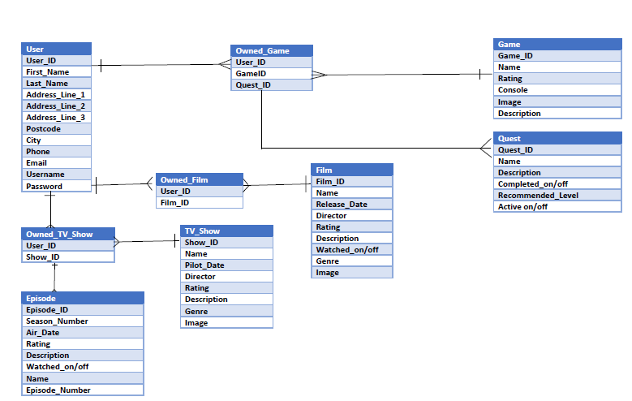

# Personal Interests Manager
This project is to develop an interface for users to create an account, and add the movies, 
tv shows and games that they follow and mark the movies and episodes that they have watched, 
and also the games quests that they have completed. 

In today's world, we watch many different tv shows and often forget where we have left off when we 
take a break from a series. The TV show section of this site will allow users to add their show and 
mark the episodes that they watch as they go so that they can easily come back later and find out where 
they left off. 

Also, we often see movies advertised that we would like to watch, only to forget about them until a year 
later when we see another advertisement. The Movies section will allow users to add a movie to their 
profile as soon as they hear of it so that they do not forget to watch it. 

Lastly, the Games section allows users to track the games that they are playing (or wish to play) and 
can mark off the quests that they have completed as they go.

## UX
This project was designed to allow users to, through CRUD functionality, manage a collection of data
related to TV shows, movies and games along with the users themselves. In particular;
- Allow users to read data from the database
- Allow users to edit the data through the web application
- Allow users to create new data through the web application
- Allow users to delete data through the web application

This website is designed for those of us who are organised and like to have a place to keep track 
of the different interests that we might have. Often in our busy lives, we can take a break from 
watching a series or playing a game, or might see an advertisement for a movie, only to forget 
where we left off or what we have not seen yet. Essentially, this website will allow those users to 
add to their profile the things that they wish to follow or keep track of. 

The functionality is in place for users to create and account and log in, and also to see their 
profile. From there they can see all movies, tv shows (and episodes), and games (along with the 
associated quests) in the database. 

I feel that this website satisfies the base requirements in that the users can create, read, update
and delete data related to items in the collections in the database in an easy to use and visually
appealing interface. 

### User Stories
#### New Users
- As a new user, I would like to be able to create an account, so that I can log into my new 
account.
#### Existing Users
- As an existing user, I would like to be able to log in, so that I can view my account.
- As an existing user, I would like to be able to add a movie I saw a trailer for, so that I will 
remember to watch it. 
- As an existing user, I would like to log out of my account, so that I can make sure no others use 
my account on this computer.
- As an existing user, I would like to mark an episode as watched, so that I can make sure I know
what episode I am to watch next.
- As an existing user, I would like to delete a show from my account, as I no longer like it and 
dont want to watch it anymore
- As an existing user, I would like to see what quest's I have left to complete on my game, so that 
I can see how much of the game is left to complete
#### Administrator Users
- As an admin user, I would like to be able to add new content to the database, so that I can 
update the collection
- As an admin user, I would like to view all users, so that I can delete those who are no longer 
valid.
- As an admin user, I would like to view all users, so that I can update the password for a user 
who has forgotten their login details.
- As an admin user, I would like to update the director of The Avengers: Endgame, so that the details 
are correct in the database.

### Wireframes
As there are many pages to this project, I have included the wireframes in a separate document. 

Please see the wireframes.md file for the entire collection of wireframes.
### Entity Relationship Diagram (ERD)

## Features
This version of the website is the administrator side of this site, which allows all users to view 
the users as well as to create, read, update and delete data related to the users, movies, tv shows, 
games, quests and episodes. Please see the Features Left to Implement section for more details on 
version two of the website.

### Existing Features
1. **Login -** The customers are able to create their own accounts and log into the website 
with secure details.
2. **Sign-Up -** New users can sign up themselves if they wish to set up an account. 
3. **User Profile -** Each user has their own profile that welcomes them by Username for
personalisation. 
4. **Create Data -** Users can add new items to the database using a simple form.
5. **Read Data -** All users can read the data from the database relating to the Movies, 
TV shows, and Games they wish to view. 
6. **Update Data -** Users can edit the data relating to the items from the database in an 
easy to use form.
7. **Delete Data -** Users can delete any item that is no longer required with one button. 
8. **User Management -** Users can currently view all users and create new users, edit them 
or delete them with our simple to use Manage Users page. 
9. **Quest tracking -** Users can update the quests in the games that they follow with an 
easy to use switch that lets them mark the quest as "active" or "completed" to help them
track their progress easier.
10. **Episode tracking -** Users can update the episodes of the shows that they watch by 
marking them as "watched" with an easy to use switch. This allows them to monitor where
they are in each show. 
11. **Log-out -** Users can log out of the website at any time by clicking on the logout 
button on any page in the nav bar. 

### Features Left to Implement
1. **Administrator Privileges -** Currently, the website is set up for users to have unlimited 
functionality once logged in. Version 2 would include a limitation on functionality depending 
on user privileges. If the user is an administrator, they will have access to all functionality
and will be able to view the user's in the manage users page. Non-administrator users will only 
have access to their own user data, their profile, and will only be able to read from the database.
2. **User Specific Content -** In version 2, when a user logs in, they will be able to view only the 
games, tv shows, and movies that they personally have added to their profile. They will also be allowed 
remove these items from their profile (which will not delete the items from the database collections)
3. **Search functionality -** In future releases, the user will be able to search by keywords 
to find items that they can add to their profile for tracking. 
4. **News Feed -** The user will be able to click on a "news feed" that will show them updates
on the interests that they follow, along with suggestions for similar content they may wish to add. 
5. **Game Trophy Tracking -** Users will be able to see the trophies available in games (where
applicable) and mark them as "unlocked" or "locked" to track their progress with these. 
6. **Current Quest Banner -** When a user clicks into a specific game, a banner at the top 
will show them the "current" quest that they should be working on. In this instance, only 
one quest can be marked as "current" and by marking a quest as "current" a popup will advise
the customer that by doing this it will mark all other quests in this game as not "current"
7. **Social Profiles -** In future releases, the user will be able to share their profile 
with friends and connect with other users to see what they follow and how they are progressing
with different interests. 
8. **Expand Interests -** In future releases, the user will be able to track other interests
on their profile such as "music" (for artists and concerts etc.) and "sports". 
9. **Login Checks -** In version 2, when a user is being created, it will prompt the user 
if the entered username or email address already exists on the database and request a different
entry. 
## Technologies Used
- HTML - This site uses HTML to instruct the browser how to interprit the code 
correctly and arrange the layout.
- CSS - This site uses CSS to aid in the style, and overall theme of the website
- Bootstrap - This site uses Bootstrap elements to help design the framework of the site
- Materialize - This site uses Materialize elements to help design forms, buttons and 
nav bar elements
- Balsamiq - This was used to create the wireframes in the design phase
- JQuery - The project uses JQuery to simplify DOM manipulation
- Bcrypt - This project uses Bcrypt to encrypt the passwords and ensure that they are 
secure.
- Flask - The site uses Flask functionality in order to manage the route redirections 
& page rendering, the flash messages and also the user session
- PyMongo - This was used to interact with the MongoDB database
- MongoDB - This was used to manage the collections and the database for the site
- flask_login - This was used to handle the users logging in and out of the site securely
- Heroku - This was chosen to host the website app for deployment.
## Testing
### Individual Page Testing
#### Index Page
- Click on "Profile" link in nav bar and verify that an error message is displayed prompting
the user that they have to log in to view the page
- Click on "Manage Users" link in nav bar and verify that an error message is displayed prompting
the user that they have to log in to view the page
- Enter a username and click the "login" button leaving the password field blank and verify that
a prompt appears that the password field must not be blank.
- Enter a password and click the "login" button leaving the username field blank and verify that
a prompt appears that the username field must not be blank. 
- Click on the "Sign Up" button below the login form and verify that it brings you to the 
sign-up page.
- Click on the "Sign Up" link in the nav bar and verify that it brings you to the sign-up page.
- Once you have created a user, logout using the logout button in the nav bar and verify that 
it brings you to the index.html page.
- Now that you have a user created, enter the correct username into the "username" field and an
incorrect password into the "password" field and click login. Verify that a message appears informing
the user that the login credentials are incorrect. 
- Enter an incorrect username into the "username" field and the correct password into the 
"password" field and click login. Verify that a message appears informing the user that the 
login credentials are incorrect. 
- Enter the correct username and password into the corresponding fields, click login and verify
that it logs in correctly and redirects you to the user profile page. 

#### Sign-Up Page
- Click on "Profile" link in nav bar and verify that you are redirected to the index.html page
and that an error message is displayed prompting the user that they have to log in to view 
the page.
- Click on "Manage Users" link in nav bar and verify that you are redirected to the index.html page
and that an error message is displayed prompting the user that they have to log in to view 
the page.
- Click the "cancel" button and verify that you are brought back to the index.html page.
- Try to submit with all fields blank and verify that an error message regarding the required 
fields is shown.
- Fill in all fields, but have "first name" field blank and submit and verify that an error 
message regarding the required fields is shown.
- Fill in all fields, but have "last name" field blank and submit and verify that an error 
message regarding the required fields is shown.
- Fill in all fields, but have "address line 1" field blank and submit and verify that an 
error message regarding the required fields is shown.
- Fill in all fields, but have "city" field blank and submit and verify that an error message 
regarding the required fields is shown.
- Fill in all fields, but have "postcode" field blank and submit and verify that an error 
message regarding the required fields is shown.
- Fill in all fields, but have "email" field blank and submit and verify that an error message 
regarding the required fields is shown.
- Fill in all fields, but have no "@" symbol in the "email" field and submit and verify that an error message 
regarding the required fields is shown.
- Fill in all fields, but have "username" field blank and submit and verify that an error 
message regarding the required fields is shown.
- Fill in all fields, but have "password" field blank and submit and verify that an error 
message regarding the required fields is shown.
- Enter all details into the form correctly and click on the "Submit" button and verify that 
the user is created and that you are redirected to the user profile page. Also verify that a 
message is displayed in red informing you that the user has been created successfully. 

#### Manage Users Page
- Click on the "New User" button and verify that you are brought to the correct page. 
- Click on the "Edit" button and verify that you are brought to the correct page. 
- Click on the "Back" button and verify that you are brought to previous page. 
- Click on the "Delete" button and verify that the item is deleted and a message is displayed
informing you that the user has been successfully deleted. 
- Click on the dropdown arrow image and verify that the users information is displayed correctly. 

#### Add User Page
- Click on "Profile" link in nav bar and verify that you are brought to the user_profile.html page.
- Click on "Manage Users" link in nav bar and verify that you are brought to the manage_users.html page
- Click the "back" button and verify that you are brought back to the last page that you had 
been on.
- Try to submit with all fields blank and verify that an error message regarding the required 
fields is shown.
- Fill in all fields, but have "first name" field blank and submit and verify that an error 
message regarding the required fields is shown.
- Fill in all fields, but have "last name" field blank and submit and verify that an error 
message regarding the required fields is shown.
- Fill in all fields, but have "address line 1" field blank and submit and verify that an 
error message regarding the required fields is shown.
- Fill in all fields, but have "city" field blank and submit and verify that an error message 
regarding the required fields is shown.
- Fill in all fields, but have "postcode" field blank and submit and verify that an error 
message regarding the required fields is shown.
- Fill in all fields, but have "email" field blank and submit and verify that an error message 
regarding the required fields is shown.
- Fill in all fields, but have no "@" symbol in the "email" field and submit and verify that an error message 
regarding the required fields is shown.
- Fill in all fields, but have "username" field blank and submit and verify that an error 
message regarding the required fields is shown.
- Fill in all fields, but have "password" field blank and submit and verify that an error 
message regarding the required fields is shown
- Enter all details into the form correctly and click on the "add user" button and verify that 
the user is created and that you are redirected to the user profile page. Also verify that a 
message is displayed in red informing you that the user has been created successfully. 

#### Edit User Page
- Click the "Edit" button next to a user in the Manage_Users.html page and verify that you are 
brought to this page and that the fields are all filled in with the users available details 
(with the exeption of the password field which should be blank for security reasons).
- Without making any changes, click on the "Save Changes" button and verify that you are brought 
back to the Manage_Users.html page
- Change any field (apart from the password field), click on the "Save Changes" button and verify 
that the information has been changed when you click on the dropdown next to the users name on 
manage_users.html
- Try to submit with all fields blank and verify that an error message regarding the required 
fields is shown.
- Fill in all fields, but have "first name" field blank and submit and verify that an error 
message regarding the required fields is shown.
- Fill in all fields, but have "last name" field blank and submit and verify that an error 
message regarding the required fields is shown.
- Fill in all fields, but have "address line 1" field blank and submit and verify that an 
error message regarding the required fields is shown.
- Fill in all fields, but have "city" field blank and submit and verify that an error message 
regarding the required fields is shown.
- Fill in all fields, but have "postcode" field blank and submit and verify that an error 
message regarding the required fields is shown.
- Fill in all fields, but have "email" field blank and submit and verify that an error message 
regarding the required fields is shown.
- Fill in all fields, but have no "@" symbol in the "email" field and submit and verify that an error message 
regarding the required fields is shown.
- Fill in all fields, but have "username" field blank and submit and verify that an error 
message regarding the required fields is shown.

#### User Profile Page
- Verify that the username used to login is displayed next to the "Welcome" heading. 
- Click on the "View My Games" button and verify that you are brought to the correct page. 
- Click on the "View My TV Shows" button and verify that you are brought to the correct page. 
- Click on the "View My Movies" button and verify that you are brought to the correct page.
- Click on the "Log Out" button in the nav bar and verify that you are logged out and can no longer
click on the "Manage Users" button or "Profile" button without logging in.  

#### My Movies Page
- Click on the "New Movie" button and verify that you are brought to the correct page. 
- Click on the "Edit" button and verify that you are brought to the correct page. 
- Click on the "User Profile" button and verify that you are brought to User Profile page. 
- Click on the "Delete" button and verify that the item is deleted and a message is displayed
informing you that the item has been successfully deleted. 
- Click on the dropdown arrow image and verify that the items information is displayed correctly. 

#### Add Movie Page
- Click the "back" button and verify that you are brought back to the last page that you had 
been on.
- Try to submit with all fields blank and verify that an error message regarding the required 
fields is shown.
- Fill in all fields, but have "film name" field blank and submit and verify that an error 
message regarding the required fields is shown.
- Enter all details into the form correctly and click on the "add movie" button and verify that 
the item is created and that you are redirected to the my_movies.html page. Also verify that a 
message is displayed in red informing you that the item has been created successfully. 

#### Edit Movie Page
- Click the "Edit" button next to a movie in the My_Movies.html page and verify that you are 
brought to this page and that the fields are all filled in with the available details 
- Click the "back" button and verify that you are brought back to the last page that you had 
been on.
- Try to submit with all fields blank and verify that an error message regarding the required 
fields is shown.
- Fill in all fields, but have "film name" field blank and submit and verify that an error 
message regarding the required fields is shown.
- Enter all details into the form correctly and click on the "save changes" button and verify that 
you are redirected to the my_movies.html page. Also verify that a message is displayed in red 
informing you that the items changes have been successfully added. 
- Delete the content from the Release Date field by clicking on the field and selecting "clear" 
on the calendar popup. Click "save changes" and verify that the "release date" span is no 
longer visible next to the items name on my_movies.html.
- Delete the content from the Image URL field. Click "save changes" and click on the item in 
my_movies.html to view its information. Verify that there is now a message prompting the user to add a link for 
an image. 

#### My Games Page
- Click on the "New Game" button and verify that you are brought to the correct page. 
- Click on the "Edit" button and verify that you are brought to the correct page. 
- Click on the "User Profile" button and verify that you are brought to correct page. 
- Click on the "Quests" button and verify that you are brought to correct page. 
- Click on the "Delete" button and verify that the item is deleted and a message is displayed
informing you that the item has been successfully deleted. 
- Click on the dropdown arrow image and verify that the items information is displayed correctly. 

#### Add Game Page
- Click the "back" button and verify that you are brought back to the last page that you had 
been on.
- Try to submit with all fields blank and verify that an error message regarding the required 
fields is shown.
- Fill in all fields, but have "game name" field blank and submit and verify that an error 
message regarding the required fields is shown.
- Fill in all fields, but have "console" field blank and submit and verify that an error 
message regarding the required fields is shown.
- Enter all details into the form correctly and click on the "add game" button and verify that 
the item is created and that you are redirected to the my_games.html page. Also verify that a 
message is displayed in red informing you that the item has been created successfully. 

#### Edit Game Page
- Click the "Edit" button next to a game in the My_Games.html page and verify that you are 
brought to this page and that the fields are all filled in with the available details 
- Click the "back" button and verify that you are brought back to the last page that you had 
been on.
- Try to submit with all fields blank and verify that an error message regarding the required 
fields is shown.
- Fill in all fields, but have "game name" field blank and submit and verify that an error 
message regarding the required fields is shown.
- Fill in all fields, but have "console" field blank and submit and verify that an error 
message regarding the required fields is shown.
- Enter all details into the form correctly and click on the "save changes" button and verify that 
you are redirected to the my_games.html page. Also verify that a message is displayed in red 
informing you that the items changes have been successfully added. 
- Delete the content from the Image URL field. Click "save changes" and click on the item in 
my_games.html to view its information. Verify that there is now a message prompting the user to add a link for 
an image. 

#### My Quests Page
- Click on the "Add Quest" button and verify that you are brought to the correct page. 
- Click on the "Edit" button and verify that you are brought to the correct page. 
- Click on the "My Games" button and verify that you are brought to correct page. 
- Click on the "Delete" button and verify that the item is deleted and a message is displayed
informing you that the item has been successfully deleted. 
- Click on the dropdown arrow image and verify that the items information is displayed correctly. 

#### Add Quest Page
- Click the "back" button and verify that you are brought back to the last page that you had 
been on.
- Try to submit with all fields blank and verify that an error message regarding the required 
fields is shown.
- Fill in all fields, but have "quest name" field blank and submit and verify that an error 
message regarding the required fields is shown.
- Enter all details into the form correctly and click on the "add quest" button and verify that 
the item is created and that you are redirected to the my_quests.html page. Also verify that a 
message is displayed in red informing you that the item has been created successfully. 

#### Edit Quest Page
- Click the "back" button and verify that you are brought back to the last page that you had 
been on.
- Try to submit with all fields blank and verify that an error message regarding the required 
fields is shown.
- Fill in all fields, but have "quest name" field blank and submit and verify that an error 
message regarding the required fields is shown.
- Enter all details into the form correctly and click on the "save changes" button and verify that 
the item is edited and that you are redirected to the my_quests.html page. Also verify that a 
message is displayed in red informing you that the item has been edited successfully. 

#### My TV Shows Page
- Click on the "New TV Show" button and verify that you are brought to the correct page. 
- Click on the "Edit" button and verify that you are brought to the correct page. 
- Click on the "User Profile" button and verify that you are brought to correct page. 
- Click on the "Episodes" button and verify that you are brought to correct page. 
- Click on the "Delete" button and verify that the item is deleted and a message is displayed
informing you that the item has been successfully deleted. 
- Click on the dropdown arrow image and verify that the items information is displayed correctly. 

#### Add TV Show Page
- Click the "back" button and verify that you are brought back to the last page that you had 
been on.
- Try to submit with all fields blank and verify that an error message regarding the required 
fields is shown.
- Fill in all fields, but have "TV show name" field blank and submit and verify that an error 
message regarding the required fields is shown.
- Enter all details into the form correctly and click on the "add tv show" button and verify that 
the item is created and that you are redirected to the my_tv_shows.html page. Also verify that a 
message is displayed in red informing you that the item has been created successfully. 

#### Edit TV Show Page
- Click the "back" button and verify that you are brought back to the last page that you had 
been on.
- Try to submit with all fields blank and verify that an error message regarding the required 
fields is shown.
- Fill in all fields, but have "TV show name" field blank and submit and verify that an error 
message regarding the required fields is shown.
- Enter all details into the form correctly and click on the "save changes" button and verify 
that the item is edited and that you are redirected to the my_tv_shows.html page. Also verify 
that a message is displayed in red informing you that the item has been edited successfully. 
- Delete the content from the Pilot Date field by clicking on the field and selecting "clear" 
on the calendar popup. Click "save changes" and verify that the "pilot date" span is no 
longer visible next to the items name on my_tv_shows.html.
- Delete the content from the Image URL field. Click "save changes" and click on the item in 
my_tv_shows.html to view its information. Verify that there is now a message prompting the user to add a link for 
an image. 

#### My Episodes Page
- Click on the "Add Episode" button and verify that you are brought to the correct page. 
- Click on the "Edit" button and verify that you are brought to the correct page. 
- Click on the "My TV Shows" button and verify that you are brought to correct page. 
- Click on the "Delete" button and verify that the item is deleted and a message is displayed
informing you that the item has been successfully deleted. 
- Click on the dropdown arrow image and verify that the items information is displayed correctly. 

#### Add Episode Page
- Click the "back" button and verify that you are brought back to the last page that you had 
been on.
- Try to submit with all fields blank and verify that an error message regarding the required 
fields is shown.
- Fill in all fields, but have "episode name" field blank and submit and verify that an error 
message regarding the required fields is shown.
- Fill in all fields, but have "episode number" field blank and submit and verify that an error 
message regarding the required fields is shown.
- Fill in all fields, but have "season number" field blank and submit and verify that an error 
message regarding the required fields is shown.
- Enter all details into the form correctly and click on the "add episode" button and verify that 
the item is created and that you are redirected to the my_episodes.html page. Also verify that a 
message is displayed in red informing you that the item has been created successfully. 

#### Edit Episode Page
- Click the "back" button and verify that you are brought back to the last page that you had 
been on.
- Try to submit with all fields blank and verify that an error message regarding the required 
fields is shown.
- Fill in all fields, but have "episode name" field blank and submit and verify that an error 
message regarding the required fields is shown.
- Fill in all fields, but have "episode number" field blank and submit and verify that an error 
message regarding the required fields is shown.
- Fill in all fields, but have "season number" field blank and submit and verify that an error 
message regarding the required fields is shown.
- Enter all details into the form correctly and click on the "save changes" button and verify that 
the item is edited and that you are redirected to the my_episodes.html page. Also verify that a 
message is displayed in red informing you that the item has been edited successfully.
- Delete the content from the Air Date field by clicking on the field and selecting "clear" 
on the calendar popup. Click "save changes" and verify that the "air date" list item is no 
longer visible in the drop down section for the item on my_episodes.html.

### Responsiveness
This website has been designed to scale correctly to different screen sizes with no issues on 
layout.

In order to ensure that the navigation bar was as responsive as possible, on Desktop the menu 
shows accross the top of the page while on mobile screens, the menu reduced to a burger icon 
with only the title visible. When the burger icon is clicked, a side menu appears with the links
to other pages from the nav bar. The first link on the nav bar is for the user to sign-up or log-out
depending on whether they have logged in or not. The second link brings them to their profile
(which in this site is essentially the home page), and the third button brings the user to the 
manage users page as this is quite an important page for admins to use. 

Each page was altered slightly between mobile and desktop for its layout to ensure that the 
user is getting the best UX possible, regardless of the screen size they are using.

### Bugs Found
- If the my_episodes or my_quests pages are viewed below 345 pixel width the buttons do not 
align correctly. This screen width is quite small, however, so this is an acceptable bug.

## Deployment
This project was deployed to Heroku at the address https://personal-interests-manager.herokuapp.com/ using the following steps

- Create a Heroku account
- Create a new app 
- Link the Heroku app with your Github repository
- Push changes to git using the terminal and verify that the connection to Heroku is working
- Add environment variables to Heroku settings. 

## Credits
### Content
- Font icons imported from Material.icon

### Acknowledgements
- I would like to acknowledge my mentor Anthony Ngene for all of his help and advice with this 
project
- I would like to thank my friends and family for their testing help and advice with this
 project
 - I would like to also thank the Code Insitute Tutor's for all of their help with some of the 
 trickier functionality in this project. In particular, Tim and Samantha, who have been a massive
 help.

